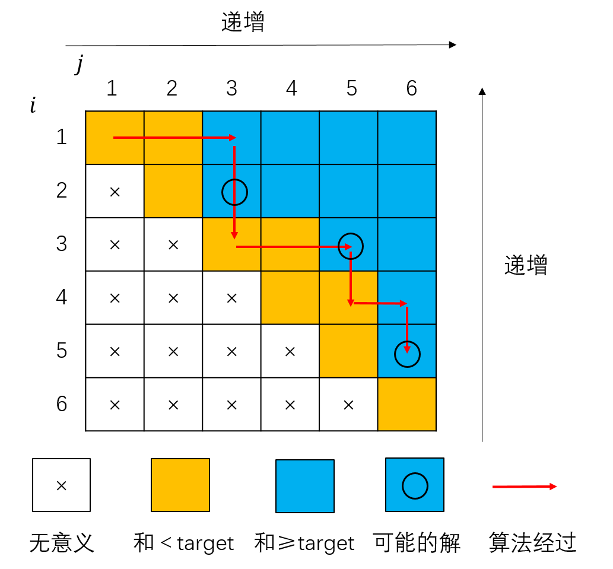

# Leetcode NoteBook

### 数组

#### [704.二分查找](https://leetcode-cn.com/problems/binary-search/)

**NOTE：**使用二分查找必要条件数组一定是排好序的数组

```python
class Solution:
    def search(self, nums: List[int], target: int) -> int:
        left, right = 0, len(nums) - 1
        while left <= right:
            mid = (left + right) // 2
            if nums[mid] < target:
                left = mid + 1
            elif nums[mid] > target:
                right = mid - 1
            else:
                return mid
        return -1
```

#### [27.移除元素](https://leetcode-cn.com/problems/remove-element/)

**描述：**给你一个数组 `nums` 和一个值 `val`，你需要 原地 移除所有数值等于` val `的元素，并返回移除后数组的新长度。

不要使用额外的数组空间，你必须仅使用 O(1) 额外空间并 原地 修改输入数组。

元素的顺序可以改变。你不需要考虑数组中超出新长度后面的元素。

**解法：**快慢指针；

```python 
class Solution:
    def removeElement(self, nums: List[int], val: int) -> int:
        i = 0
        j = 0
        while(i<len(nums)):
            if nums[i] != val:
                nums[j] = nums[i]
                i += 1
                j += 1
            else:
                i += 1
        return len(nums) - (i - j)
```

#### [977.有序数组的平方](https://leetcode-cn.com/problems/squares-of-a-sorted-array/)

**描述：**给你一个按 **非递减顺序** 排序的整数数组 `nums`，返回 **每个数字的平方** 组成的新数组，要求也按 **非递减顺序** 排序。

**解法：**暴力平方+排序；左右指针；

```python
class Solution:
    def sortedSquares(self, nums: List[int]) -> List[int]:
        result = []
        left, right = 0, len(nums) - 1
        while left <= right:
            if nums[left] * nums[left] > nums[right] * nums[right]:
                result.append(nums[left] * nums[left])
                left += 1
            elif nums[left] * nums[left] <= nums[right] * nums[right]:
                result.append(nums[right] * nums[right])
                right -= 1
        result = result[::-1]
        return result
```

#### [209. 长度最小的子数组](https://leetcode-cn.com/problems/minimum-size-subarray-sum/)

**描述：**给定一个含有 n 个正整数的数组和一个正整数 target 。

找出该数组中满足其和 ≥ target 的长度最小的 连续子数组 [numsl, numsl+1, ..., numsr-1, numsr] ，并返回其长度。如果不存在符合条件的子数组，返回 0 。

**解法：**滑动窗口（双指针）

```python
class Solution:
    def minSubArrayLen(self, target: int, nums: List[int]) -> int:
        i, j = 0, 1
        min_length = len(nums) + 1
        while j <= len(nums):
            if sum(nums[i:j]) < target:
                j += 1
            else:
                i += 1
                length = j - i + 1
                if length < min_length:
                    min_length = length
        return 0 if min_length == len(nums) + 1 else min_length
```

**解析：**我们画一个图来解释：



横纵坐标代表一个连续子数组的左右起点与终点，其中终点小于起点的值无意义，图中标注为 × ；图中的格子表示一种状态，橘黄色表示 $[i,j]$ 区间之和小于 $target$，蓝色表示大于等于 $target$ ；很容易想到就是，固定起点，终点坐标越大，区间之和越大（图中从左至右的箭头）；固定终点，起点坐标越小，区间之和越大（图中从下至上的箭头）。则某一状态 $[i,j]$ 如果满足要求（蓝色），则其上，其右都满足要求（蓝色），即：若状态 $[i,j]$ 满足，则对于任意 $k\leq i$ ，状态 $[k, j]$ 也满足，对于任意 $k\geq j$ ， 状态 $[i,k]$​​​​也满足。所以在和大于等于目标值的所有状态中，可能的最优解为上图有⚪的格子，滑动窗口的所经过的状态如上红色箭头所示所示，可以看出滑动窗口算法永远会经过最优值的状态。

### 链表

#### [203.移除链表元素](https://leetcode-cn.com/problems/remove-linked-list-elements/)

**描述：**给你一个链表的头节点 `head` 和一个整数 `val` ，请你删除链表中所有满足 `Node.val == val` 的节点，并返回 **新的头节点** 。

**解法：**一般遍历；

**NOTE：**哑节点

```python
# Definition for singly-linked list.
# class ListNode:
#     def __init__(self, val=0, next=None):
#         self.val = val
#         self.next = next
class Solution1:
    def removeElements(self, head: ListNode, val: int) -> ListNode:
        '''
        	一般遍历
        '''
        dummyhead = ListNode(val=None, next=head)
        tmp = dummyhead
        while tmp.next != None:
            if tmp.next.val == val:
                tmp.next = tmp.next.next
            else:
                tmp = tmp.next
        return dummyhead.next
```

#### [206.反转链表](https://leetcode-cn.com/problems/reverse-linked-list/)

**描述：**给你单链表的头节点 `head` ，请你反转链表，并返回反转后的链表。

**解法：**双指针；栈/递归；

**NOTE：**哑节点

```python
# Definition for singly-linked list.
# class ListNode:
#     def __init__(self, val=0, next=None):
#         self.val = val
#         self.next = next
class Solution:
    '''
    	双指针
    '''
    def reverseList(self, head: ListNode) -> ListNode:
        p, q = None, head
        while q != None:
            tmp = q.next
            q.next = p
            p, q = q, tmp
        return p
```

```python
# class ListNode:
#     def __init__(self, val=0, next=None):
#         self.val = val
#         self.next = next
class Solution:
    '''
    	栈/递归
    '''
    def reverseList(self, head: ListNode) -> ListNode:
        nodelist = [None]
        p = head
        while p != None:
            nodelist.append(p)
            p = p.next
        nodelist = nodelist[::-1]
        for i in range(len(nodelist)-1):
            nodelist[i].next = nodelist[i+1]
        return nodelist[0]
```

#### [19.删除链表得倒数第N个结点](https://leetcode-cn.com/problems/remove-nth-node-from-end-of-list/)

**描述：**给你一个链表，删除链表的倒数第 `n` 个结点，并且返回链表的头结点。

**解法：**快慢指针；

**NOTE：**哑节点

```python
# Definition for singly-linked list.
# class ListNode:
#     def __init__(self, val=0, next=None):
#         self.val = val
#         self.next = next
class Solution:
    def removeNthFromEnd(self, head: ListNode, n: int) -> ListNode:
        dummyhead = ListNode(val=None, next=head)
        slow = dummyhead
        fast = dummyhead
        for i in range(n):
            fast = fast.next
        while fast.next != None:
            slow = slow.next
            fast = fast.next
        slow.next = slow.next.next
        return dummyhead.next
```

#### [面试题 02.07. 链表相交](https://leetcode-cn.com/problems/intersection-of-two-linked-lists-lcci/)

**描述：**给你两个单链表的头节点 `headA` 和 `headB` ，请你找出并返回两个单链表相交的起始节点。如果两个链表没有交点，返回 `null` 。

**解法：**遍历，逆序查找；

```python
# Definition for singly-linked list.
# class ListNode:
#     def __init__(self, x):
#         self.val = x
#         self.next = None

class Solution:
    def getIntersectionNode(self, headA: ListNode, headB: ListNode) -> ListNode:
        a = []
        b = []
        p = headA
        while p != None:
            a.append(p)
            p = p.next
        p = headB
        while p != None:
            b.append(p)
            p = p.next

        tmp = None
        for i in range(-1, -1 * min(len(a), len(b)) -1, -1):
            if a[i] == b[i]:
                tmp = a[i]
            else:
                break
        return tmp
```

#### [142. 环形链表 II](https://leetcode-cn.com/problems/linked-list-cycle-ii/)

**描述：**给定一个链表，返回链表开始入环的第一个节点。 如果链表无环，则返回 `null`。

**解法：**快慢指针；

```python
# Definition for singly-linked list.
# class ListNode:
#     def __init__(self, x):
#         self.val = x
#         self.next = None

class Solution:
    def detectCycle(self, head: ListNode) -> ListNode:
        '''
        	快慢指针
        '''
        # 寻找快慢指针相遇点
        dummyhead = ListNode(val=None, next=head)
        slow = dummyhead
        fast = dummyhead
        while fast and fast.next:
            slow = slow.next
            fast = fast.next.next
            if slow == fast:
                # 快慢指针相遇 => 存在环 => 求环入口
                finder = dummyhead
                while finder != slow:
                    finder = finder.next
                    slow = slow.next
                return finder
        return None
```

**解析：**快慢指针同时从哑节点出发，快指针一次走两个节点，如果快指针为None或其next为None则意味着到达链表终点，无环；如果快慢指针相遇，则意味着有环，接下来考虑如何求环的入口。假设环长度为 $y$ ，链表头到环入口长度 $x$ ，环入口距离快慢指针相遇点长度 $d$，则有：
$$
\begin{aligned}
\begin{cases}
&f = 2s \\
&s = x + py +d \\
&f = x + qy +d \\
\end{cases}
\end{aligned}
$$
 其中 $f$ ，$s$​ 分别为快慢指针相遇时，快慢指针走过的长度；$p$ ， $q$ 为非负整数代表在环内转了多少圈。令第三行式减第二行式有：
$$
f-s=(q-p)y
$$
又有(1)式得 
$$
f - s=s
$$
则有 $s=(q-p)y$ 两边同时加一个 $x$​ 有：
$$
s +x =(q-p)y +x
$$
从(4)式右边可以看出，$x$ 等价于某指针`finder`从哑节点出发，到达环入口，又由于$p$ ， $q$ 为非负整数，$(q-p)y$​​​ 等于环长度的整数倍，依然回到环入口，即，快慢指针相遇后，慢指针再走 $x$ 的距离就到了环入口。

### 字符串

#### [344. 反转字符串](https://leetcode-cn.com/problems/reverse-string/)

**描述：**编写一个函数，其作用是将输入的字符串反转过来。输入字符串以字符数组 s 的形式给出。

不要给另外的数组分配额外的空间，你必须原地修改输入数组、使用 O(1) 的额外空间解决这一问题。

**解法：**左右指针；

```python
class Solution:
    def reverseString(self, s: List[str]) -> None:
        """
        Do not return anything, modify s in-place instead.
        """
        i, j = 0, len(s) - 1
        while i <= j:
            s[i], s[j] = s[j], s[i]
            i += 1
            j -= 1
```

#### [541. 反转字符串 II](https://leetcode-cn.com/problems/reverse-string-ii/)

**描述：**给定一个字符串 s 和一个整数 k，从字符串开头算起，每计数至 2k 个字符，就反转这 2k 字符中的前 k 个字符。

如果剩余字符少于 k 个，则将剩余字符全部反转。
如果剩余字符小于 2k 但大于或等于 k 个，则反转前 k 个字符，其余字符保持原样。

**解法：**

#### [剑指 Offer 05. 替换空格](https://leetcode-cn.com/problems/ti-huan-kong-ge-lcof/)

**描述：**请实现一个函数，把字符串 `s` 中的每个空格替换成"%20"。

**解法：**Python自带函数；一般遍历；

```python
class Solution:
    def replaceSpace(self, s: str) -> str:
        return '%20'.join(s.split(' '))
```

```python
class Solution:
    def replaceSpace(self, s: str) -> str:
        charlist = []
        for i in range(len(s)):
            if s[i] == ' ':
                charlist.append('%20')
            else:
                charlist.append(s[i])
        
        s = ''
        for i in charlist:
            s += i
        return s
```

#### [剑指 Offer 58 - II. 左旋转字符串](https://leetcode-cn.com/problems/zuo-xuan-zhuan-zi-fu-chuan-lcof/)

**描述：**字符串的左旋转操作是把字符串前面的若干个字符转移到字符串的尾部。请定义一个函数实现字符串左旋转操作的功能。比如，输入字符串"abcdefg"和数字2，该函数将返回左旋转两位得到的结果"cdefgab"。

**解法：**python字符串基本的切片（不能切片就遍历）

```python
class Solution:
    def reverseLeftWords(self, s: str, n: int) -> str:
        return s[n:] + s[:n]
```


还没整理：

225.用队列实现栈
1.用单个队列： 

19.删除链表倒数第N个节点
哑结点：在原链表的head前加一个“伪头结点”指向head，以应对链表长度为1，或被删除的节点为头结点的情况。
(当然也可以利用if判断做特殊处理) 

1. 栈： 利用栈的先入后出性质。第一次遍历：由链表哑结点开始遍历链表，依次入栈。然后依次出栈并计数，当
	出栈数为n时即找到倒数第N个节点。时间O(N)空间O(N) 

2. 双指针：A

64.矩阵最小路径和
对于矩阵中的元素，要么从上面来，要么从左边来，那么选择左边路径和上面路径中路径和最小的即可。 
构造dp矩阵，矩阵中的值表示从左上角开始到该位置的最小路径和。初始矩阵中的第一行元素，因为第一行的所有位置
只能从左边来。同理初始化矩阵中第一列元素。从矩阵的\[1\]\[1\]开始遍历直到右下角为止。
